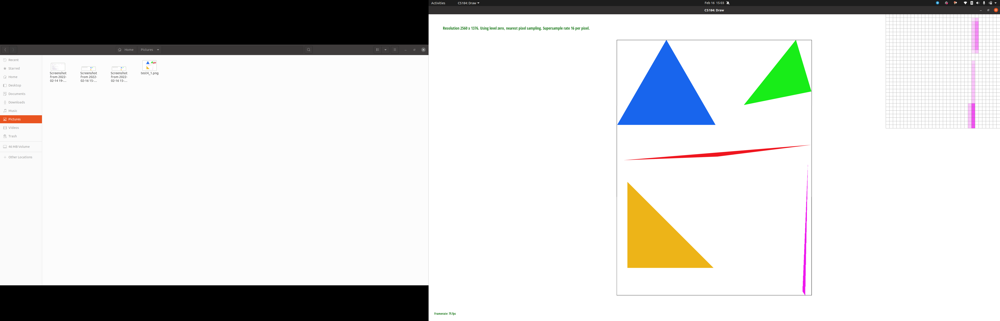

## Part 1: Rasterizing single-color triangles

We first finding a bounding box by calculating the minimum and maximum
x and y coordinates. For each point, we determine whether it's inside
or outside the triangle by testing the orientation using the dot
product between the normal vector to the line and the vector
containing the point and a vertex of the line. If we traverse the
points in a clockwise manner, all signs should be negative. In
contrast, if we traverse the points in a counterclockwise manner, all
signs should be positive. To handle cases where the point lies on the
edge of the triangle, we denote landing on a line as `MAYBE`. Then we
enumerate all possibilities combinations of `TRUE/FALSE/MAYBE`s that
imply landing on or inside the triangle (either 2 MAYBEs which means
it's a corner, 1 `MAYBE` and two `FALSE`s, or 1 `MAYBE` and two
`TRUE`s). In the case the point is in the triangle, we update the
sample buffer with the color of the triangle.

