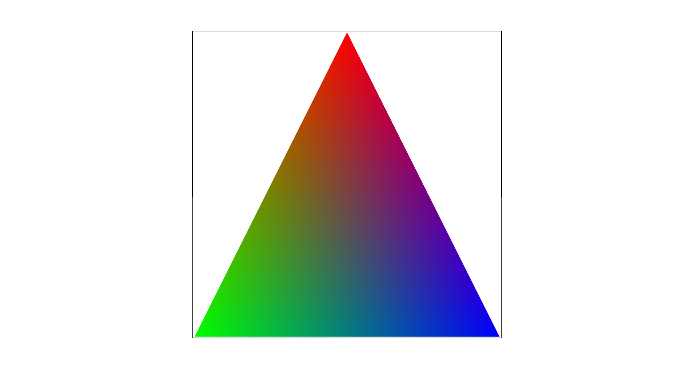
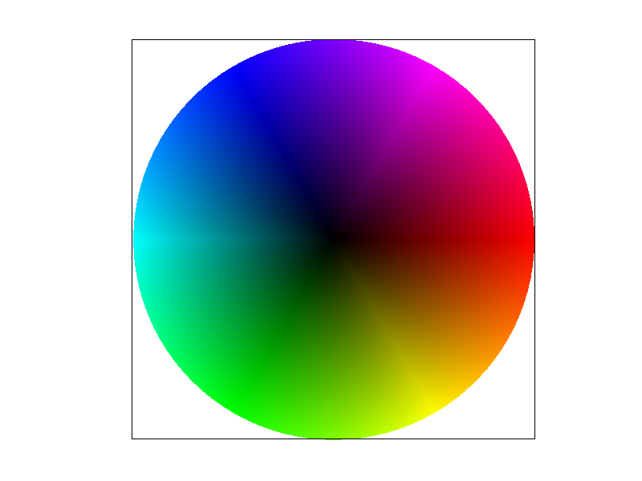

## Task 4: Barycentric Coordinates

Barycentric coordinates can be seen as a way to figure out the
distance from the three vertices of a triangle, providing a coordinate
system that is relative to the triangle. They allow us to
smoothly blend attributes at the vertices of a triangle. The attribute
of interest for us is color in this part, but it can also be used to
help translate between image and texture coordinates by blending the
texture coordinates at each of the vertices.

The figure above demonstrates the blending of colors using barycentric
coordinates. Each vertex is assigned a pure color: top is red $r$, left is
green $g$, and right is blue $b$. In order to color each of the other
pixels in the triangle, we first compute the barycentric coordinates
of the point using the formula presented in lecture. Let those
coordinates be $(\alpha, \beta, \gamma)$. Then, the color of the pixel
is given by $\alpha r + \beta g + \gamma b$. This provides an
intuitive visualization of barycentric coordinates.

Below is a screenshot of a color wheel made using triangles colored
using barycentric coordinates to determine the color of the pixels.

