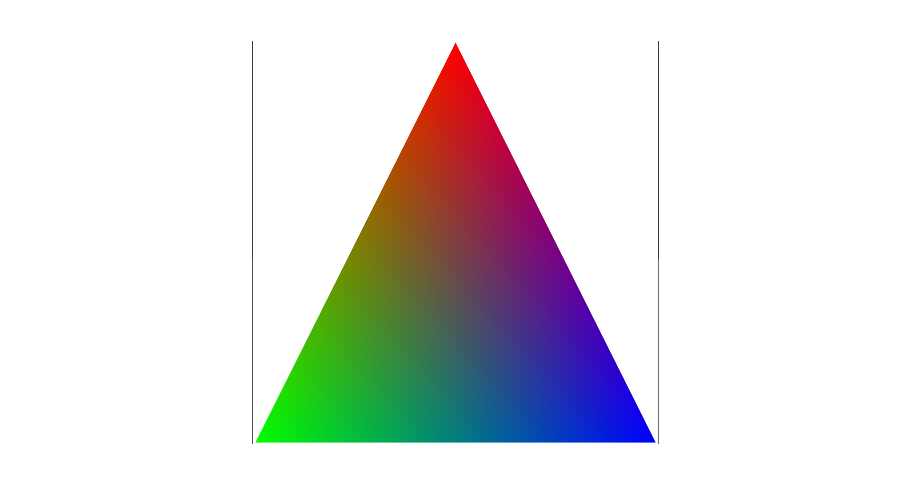

## Task 4: Barycentric Coordinates

Barycentric coordinates can be seen as a way to figure out the
distance from the three vertices of a triangle, providing a coordinate
system that is relative to the triangle. They allow us to
smoothly blend attributes at the vertices of a triangle. The attribute
of interest for us is color in this part, but it can also be used to
help translate between image and texture coordinates by blending the
texture coordinates at each of the vertices.

